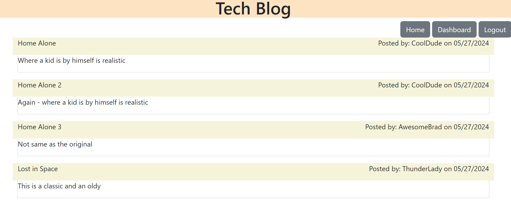
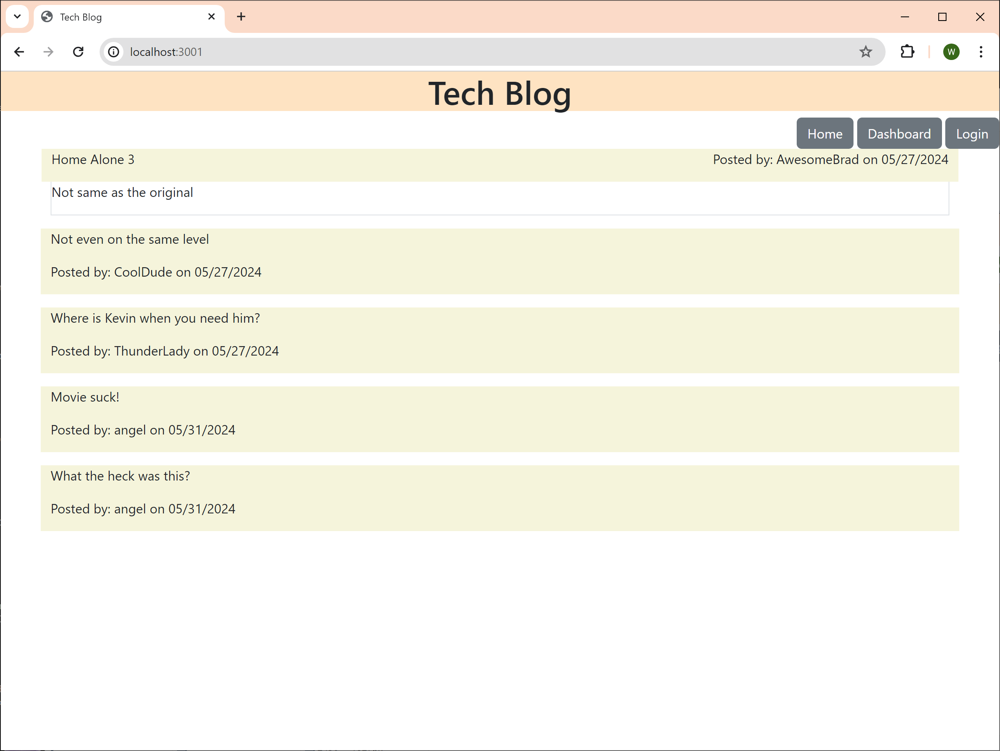
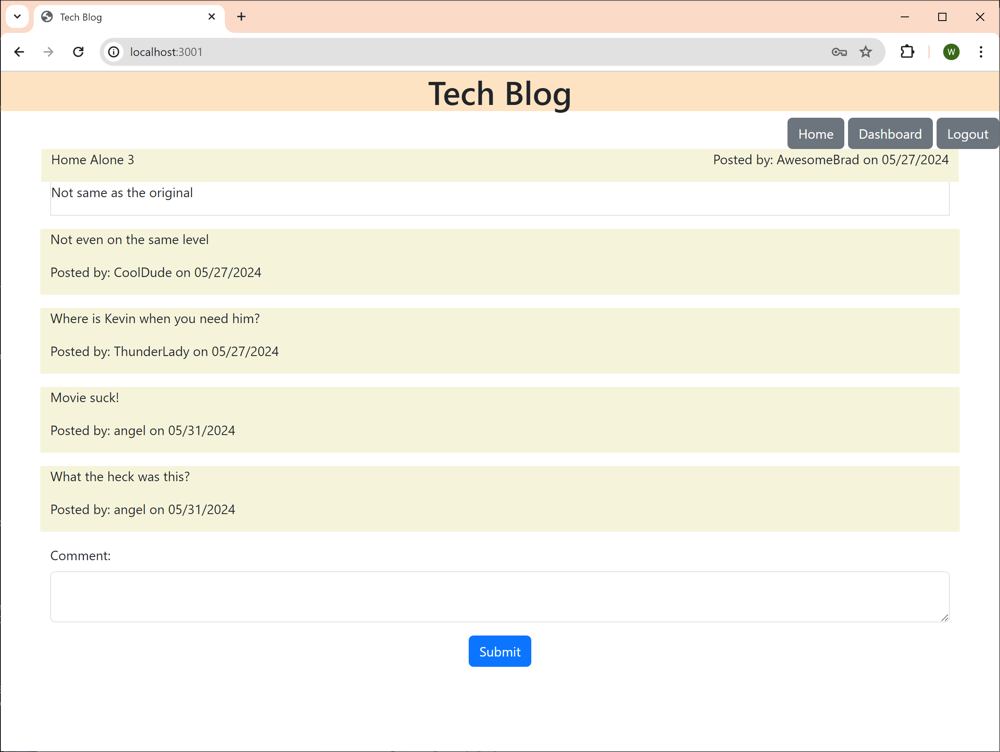
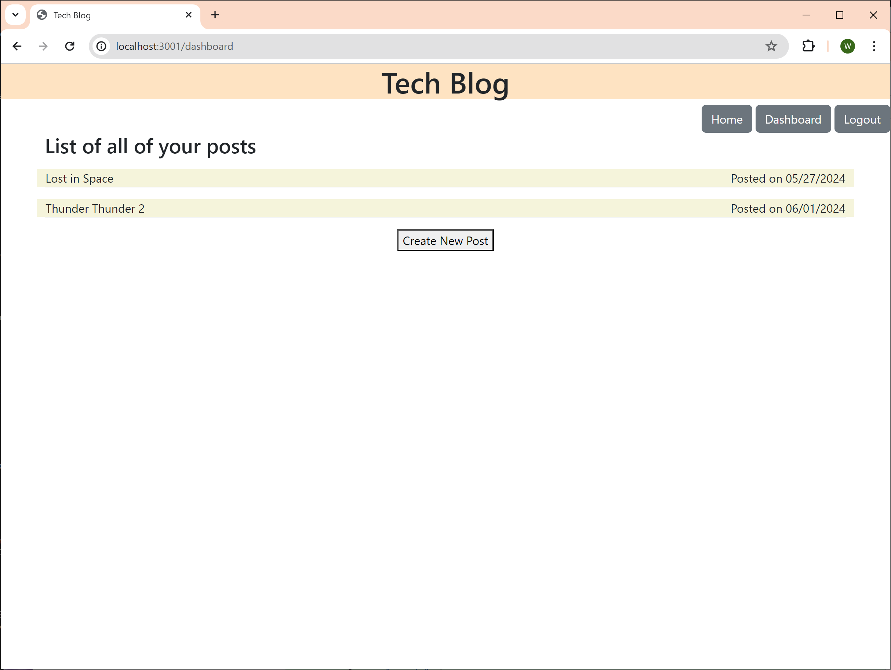
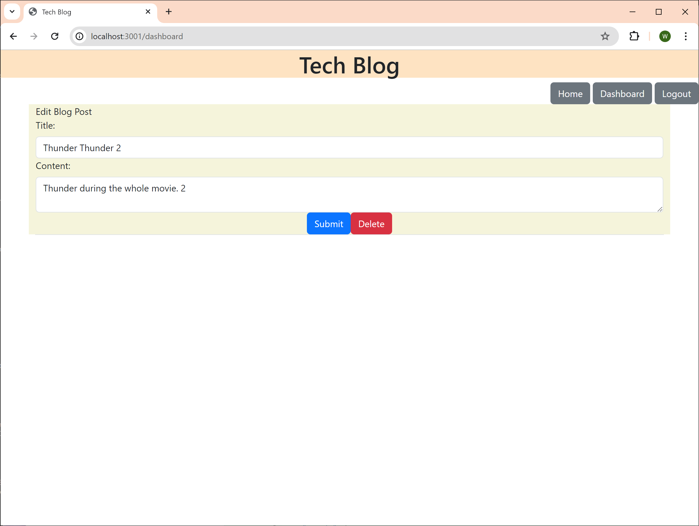

# Tech Blog Applicaiton

## Table of Contents
- [Description](#description)
- [Usage](#usage)

## Description
The Tech Blog application users to post blogs and post comments to the post.  In addition, the user can edit their posts and delete them.  Non-users can always view the Homepage which shows all the posts and comments, but cannot add any comments or posts.

Deployment URL - https://tech-blog-uxix.onrender.com/

GitHub Repo URL - https://github.com/whougie/tech-blog.git

## Usage
To run the application, run the command 'npm run start'

To seed the application, send a POST request to /api/seeds

Homepage will allow the posts and comments to be viewed by all, but only users can add new comments

Non-user cannot add new comments:

Users can add new comments:

Users can see their existing posts and create new posts

Users can edit or delete their posts

